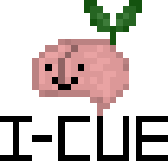

# I-Cue



Hi! This is I-Cue, our team’s submission for StormHacks 2022, a studying aid that helps you improve recall.

One of the most impactful forms of studying is an increase in intensity. The shift to online learning during the COVID-19 pandemic highlighted the need for diverse educational tools and strategies as the pandemic had a negative impact on student learning. Existing assistive technologies that test one’s recall are proven to increase the grade of 90% of students. Tools like Kahoot and Quizlet use multiple choice and flash cards to test your memory. What I-Cue does is use AI to examine the context of your answers to test understanding instead of rote memorization. I-Cue was inspired by what scientists have dubbed the protégé effect, where research has shown, is one of the best ways to facilitate your learning process.

## Meet the Team
- Jessica Hong
  - Jessica is our resident designer and backend developer. She created I-Cue's logo which features Hedgar the happy brain sprout and is the mastermind behind     our study aid's concept. Thanks to Jessica's planning for the color palette, wireframes and connecting of Firebase we are able to have an application which     we are proud to show and can be used by many users.
  - https://www.linkedin.com/in/jeessicahong/
- Edgar Coime
  - Edgar is our system architect and full-stack developer. He is the originator of the cue card and machine learning combination which is the heart of I-       Cue. Mr. Coime is our programming polymath who knows exactly what is missing from your line of code. He implemented Jessica's wireframes and UX flow.
  - https://www.linkedin.com/in/edgarcoime/
- Kat Olaguer
  - Kat is our full-stack developer. They designed the algorithm + logic behind I-Cue's answering system using a temperature of matched keywords of user       input and OpenAI's important phrases. She wrote these descriptions and loves her teammates.
  - https://www.linkedin.com/in/katolaguer/

## Getting Started

### OpenAI Logic 
1. Sign up for and create an OpenAI API key: https://openai.com/api/
2. Add an .env.local file to the LOGICUP main directory
3. Add your API key to the file and save: NEXT_PUBLIC_OPENAI_KEY="your key goes here"

### Prerequisites
Yarn:
```npm install -g yarn```

To set up the dependencies:
```
yarn install
```
### Run Application
Run the development server:

```bash
yarn dev
```

Open [http://localhost:3000](http://localhost:3000) with your browser to see the result.

## Future Implementations
1. Add syntactic analysis for nouns as entities for improved context queries using Google Cloud natural language API 
2. Check adverbs and root words in keywords
3. Improve input filtering + find's algorithm speed
4. Add edit and delete functionality to cards.
5. Link AssemblyAI speech-to-text API with card answering logic. 
6. Add a sign language answering functionality.
